# Daggerheight Ranges

A relative, 3D-aware range and altitude measuring tool for [Owlbear Rodeo](https://www.owlbear.rodeo/). Drag from an Origin — a point or a token — and see live range rings, a Reading on every other token, and optional persistent height markers.

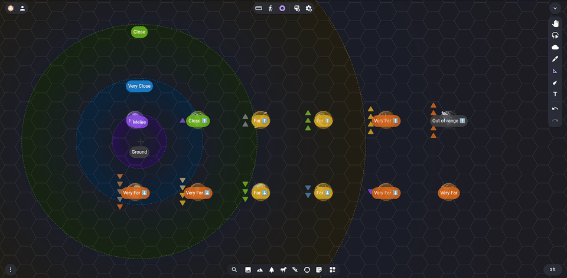

## Features

- **Relative range measuring** — click and drag from any point or token to reveal concentric range bands (Melee, Very Close, Close, Far, Very Far — or your own).
- **Height / altitude tracking** — right-click a token to set a persistent height marker, or nudge height live with hotkeys while measuring. Readings account for height in 3D, with a choice of spherical, cubic, or cylindrical distance.
- **Three built-in presets** — Dagger, Steel, and Dragons — or build your own set of ranges from scratch.
- **Multiple visualization styles** — icon stacks, rings, or filled circles, independently sized and colored.
- **Color-blind friendly themes** — Base, Deuteranopia, Tritanopia, and Protanopia.
- **Bilingual** — Español / English, switchable per room.
- **Configurable hotkeys and feature toggles** — strip it back to plain range-rings with no per-token readings or height tracking at all, if that's all you need.

## In action

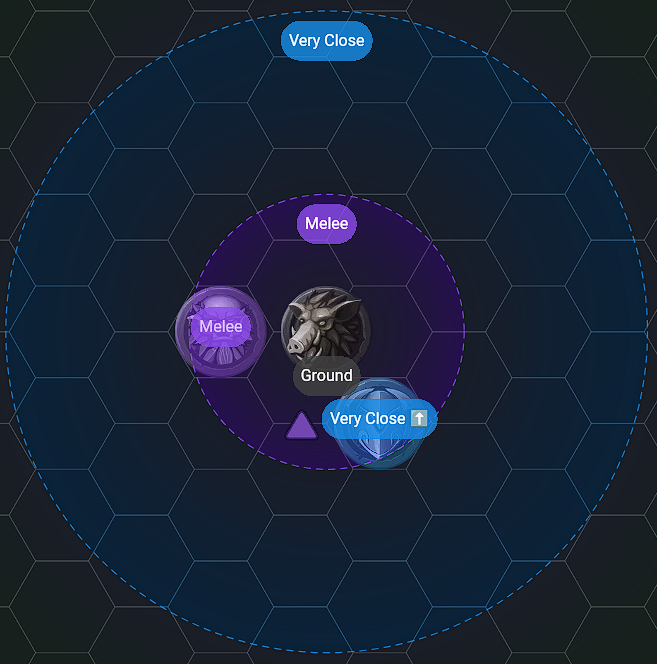

Drag from a token or an empty point to set your Origin. Every other token gets a live Reading showing which range band it's in, with an arrow if it's above or below you.

## Height markers

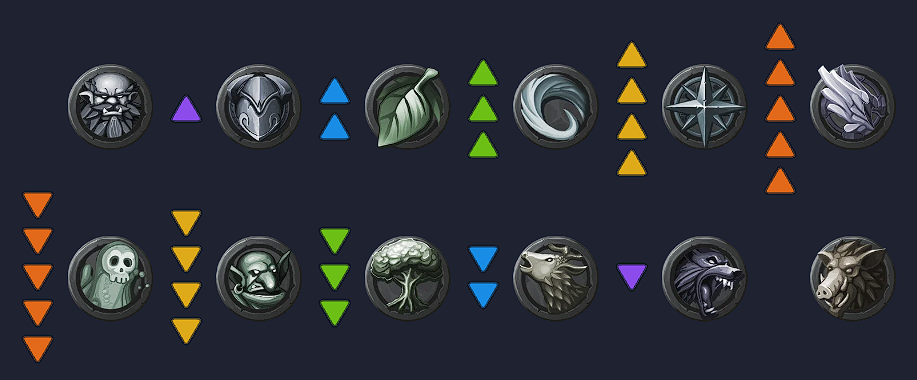

Right-click any token to set a persistent height marker that sticks around outside of a Measurement.

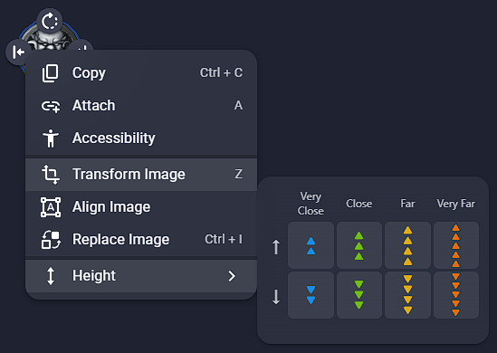

## Build your own ranges

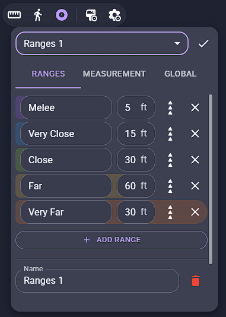

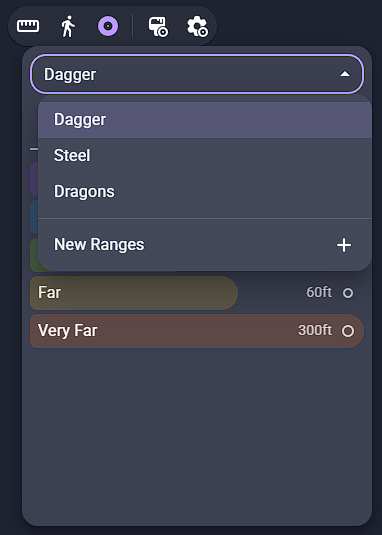

Start from Dagger, Steel, or Dragons, or build your own — name each range, set its radius, reorder, or delete it.

## Measurement settings

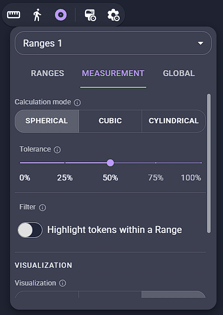

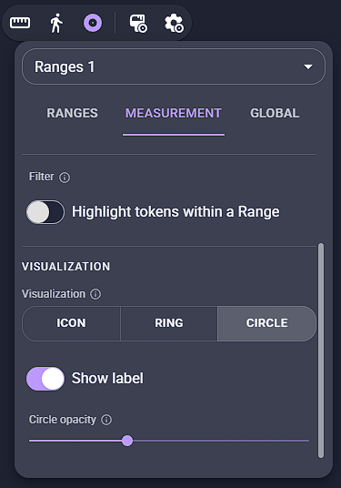

Choose how distance is calculated (spherical / cubic / cylindrical), how forgiving Tolerance is, and how each Reading is drawn (icon / ring / circle).

## Global settings

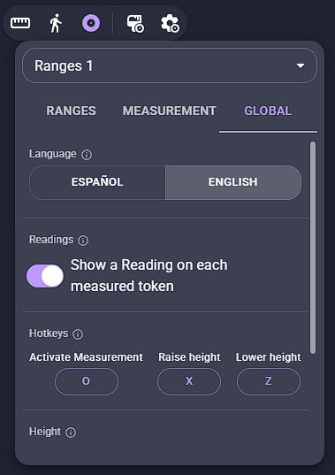

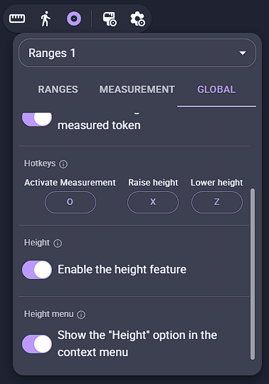

Set the room's language and hotkeys, and toggle whole feature groups on or off — including stripping the extension back to plain range-rings with no readings or height tracking.

## Color-blind themes

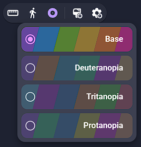

## Installation

In Owlbear Rodeo, open the Extensions panel and add this manifest URL:

```
https://daggerheight2.ijpedraza.com/manifest.json
```

## About this fork

This project is a modified version of [Ranges](https://github.com/owlbear-rodeo/ranges) by Owlbear Rodeo, licensed under the GNU GPLv3. It merges Ranges' range-ring rendering with a relative altitude/height mechanic and a configurable 3D distance engine.

## License

GNU GPLv3 — see [`LICENSE`](./LICENSE).

## Support

Found a bug or have a feature request? Open an issue on [GitHub](https://github.com/nachoijp/Daggerheight-Ranges/issues).

## Contributing

Not currently accepting outside contributions.

Copyright (C) 2024 Owlbear Rodeo
Copyright (C) 2026 Ignacio Pedraza (modifications)
