# Daggerheight Ranges

A relative, 3D-aware range and altitude measuring tool for [Owlbear Rodeo](https://www.owlbear.rodeo/). Drag from an Origin — a point or a token — and see live range rings, a Reading on every other token, and optional persistent height markers.

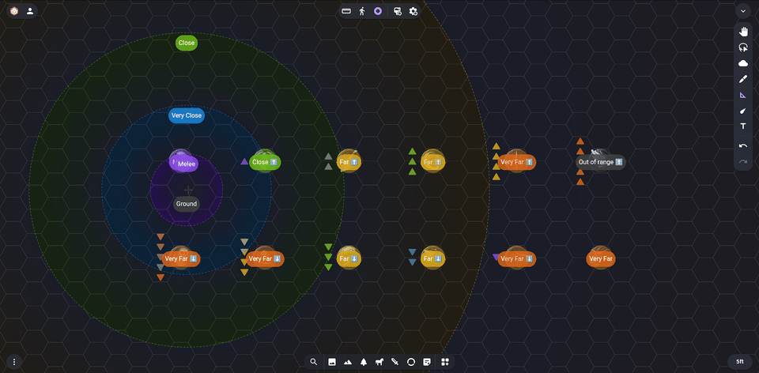

## Features

- **Relative range measuring** — click and drag from any point or token to reveal concentric range bands (Melee, Very Close, Close, Far, Very Far — or your own).
- **Height / altitude tracking** — right-click a token to set a persistent height marker, or nudge height live with hotkeys while measuring. Readings account for height in 3D, with a choice of spherical, cubic, or cylindrical distance.
- **Three built-in presets** — Dagger, Steel, and Dragons — or build your own set of ranges from scratch.
- **Multiple visualization styles** — icon stacks, rings, or filled circles, independently sized and colored.
- **Exact numbers when you want them** — optionally add each token's exact distance to its Reading ("Close · 15ft"), and show height markers as icons, as a "⬆️ 30ft" label, or both.
- **Distances panel** — a list of every token's Range, horizontal and vertical distance, and total distance from any token you pick, live as tokens move. For the GM only or for everyone; players never see hidden tokens.
- **Color-blind friendly themes** — Base, Deuteranopia, Tritanopia, and Protanopia.
- **Bilingual** — Español / English, switchable per room.
- **Configurable hotkeys and feature toggles** — strip it back to plain range-rings with no per-token readings or height tracking at all, if that's all you need.

## In action

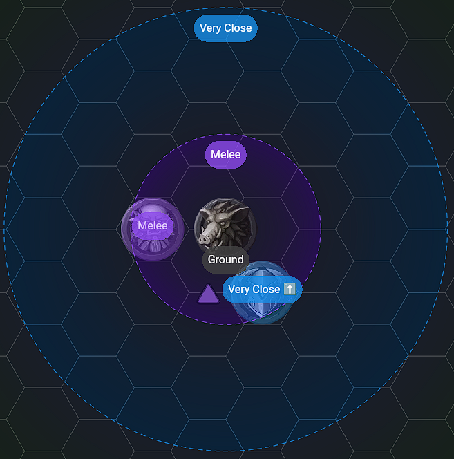

Drag from a token or an empty point to set your Origin. Every other token gets a live Reading showing which range band it's in, with an arrow if it's above or below you.

## Height markers

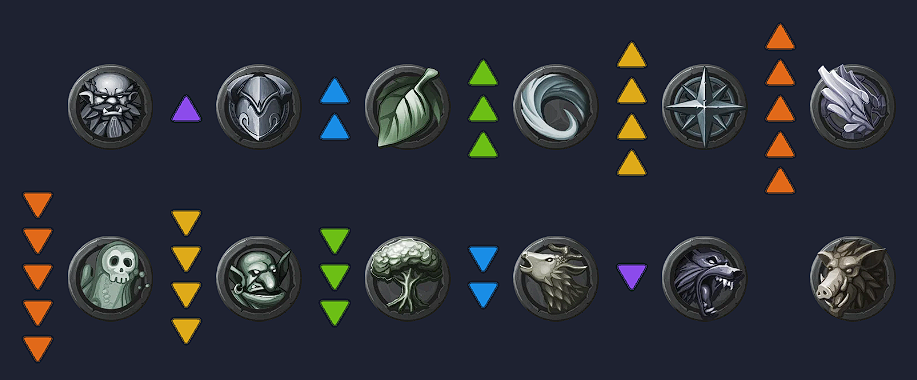

Right-click any token to set a persistent height marker that sticks around outside of a Measurement.

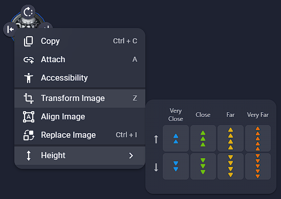

## Build your own ranges

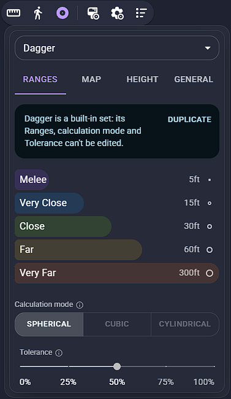

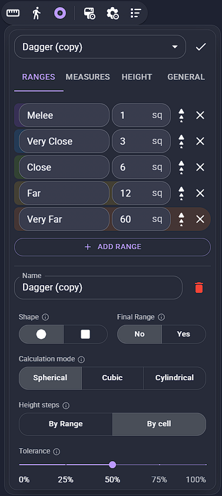

Start from Dagger, Steel, or Dragons — duplicate one to edit it — or build your own: name each range, set its radius and icon, add or delete ranges, and pick the rings' shape, the calculation mode (spherical / cubic / cylindrical) and how forgiving Tolerance is.

## What shows on the map

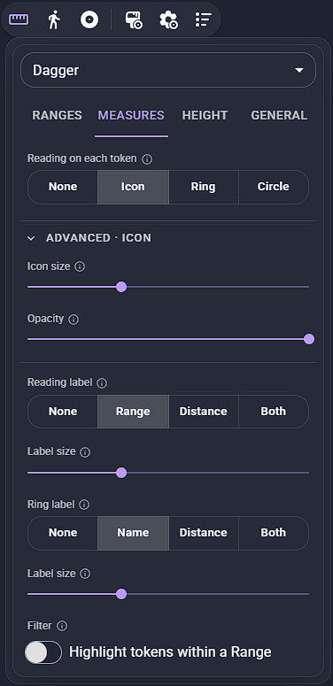

How each measured token is marked (an icon, a ring, a circle, or nothing), with its size and opacity under Advanced; what its label says (the Range, the exact distance, or both); what the rings around the Origin say; and an optional filter that highlights the tokens within a chosen Range. These are room settings, so they work with any set of ranges, presets included.

## Height

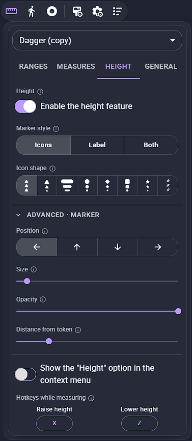

Turn the whole height feature on or off, show markers as icons, as a "⬆️ 30ft" label, or both, pick the icon shape, fine-tune the marker's position, size, opacity and distance under Advanced, and set the hotkeys that raise or lower the Origin while measuring.

## Distances panel

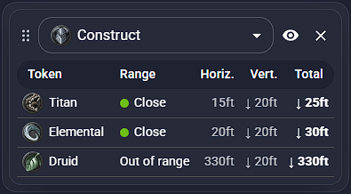

Pick or select a token to list every other one with its Range and its horizontal, vertical and total distance, live as tokens move. It stays open while you work on the map. The GM decides whether it's for the GM only or for everyone; players never see hidden tokens.

## General

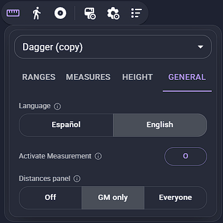

The room's language, the key that activates Measurement, and who gets the Distances panel. Every setting applies right away — no reload needed — and their defaults keep the extension looking the way it always has until you change them.

## Color-blind themes

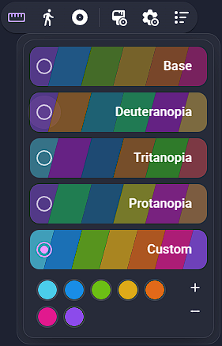

## Installation

In Owlbear Rodeo, open the Extensions panel and add this manifest URL:

```
https://daggerheight2.ijpedraza.com/manifest.json
```

## About this fork

This project is a modified version of [Ranges](https://github.com/owlbear-rodeo/ranges) by Owlbear Rodeo, licensed under the GNU GPLv3. It merges Ranges' range-ring rendering with a relative altitude/height mechanic and a configurable 3D distance engine.

## License

GNU GPLv3 — see [`LICENSE`](./LICENSE).

## Support

Found a bug or have a feature request? Open an issue on [GitHub](https://github.com/nachoijp/Daggerheight-Ranges/issues).

## Contributing

Not currently accepting outside contributions.

Copyright (C) 2024 Owlbear Rodeo
Copyright (C) 2026 Ignacio Pedraza (modifications)
